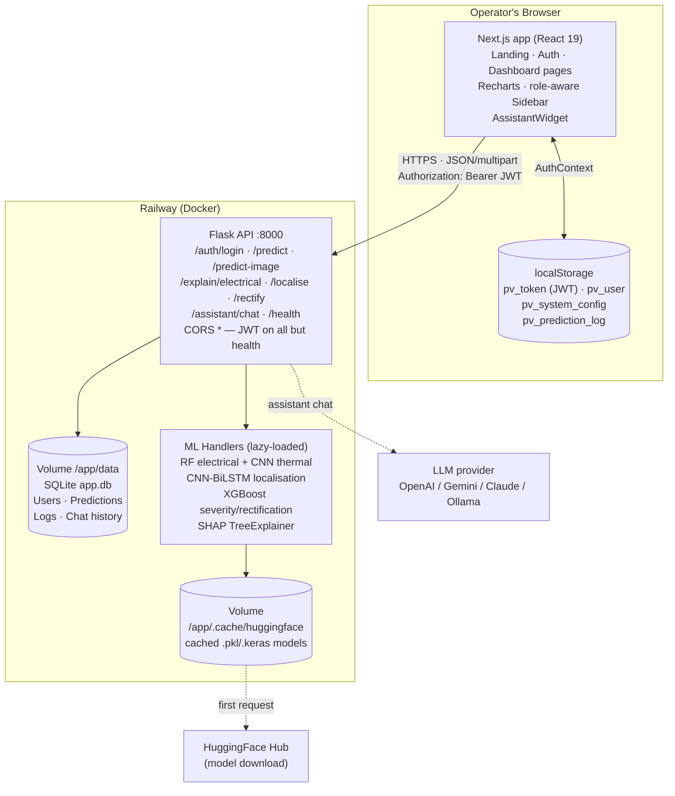

# System Architecture — OpenPVisor Insight

Post-migration architecture: the Streamlit dashboard has been replaced by a
Next.js frontend (Vercel) that talks to the Flask API (Railway) over HTTPS.
The Flask API is unchanged apart from a two-line bugfix in the localise
DB-write calls.

```
OPERATOR'S BROWSER (Next.js on Vercel, React 19)
├─ Pages: / /auth /dashboard{detection localisation severity
│         rectification history config help}
├─ AuthContext ── localStorage: pv_token(JWT), pv_user(role)
├─ prediction log ── localStorage: dashboard + history data
└─ AssistantWidget 💬 ── Recharts · role-aware Sidebar
        │  HTTPS · JSON/multipart · Authorization: Bearer <JWT>
        ▼
RAILWAY — Docker container: Flask API (:8000)
├─ POST /auth/login → JWT          (CORS *, all else JWT-protected)
├─ POST /predict · /predict-image      → FaultDetectionHandler
│                                        RF electrical + CNN thermal
├─ POST /explain/electrical            → SHAP TreeExplainer
├─ POST /localise (CSV | image)        → CNN-BiLSTM strings / hotspot bbox
├─ POST /rectify                       → XGBoost action recommender
├─ POST/GET /assistant/chat|history    → LLM provider
└─ GET  /health                        (unauthenticated)
        │                          │
        ▼                          ▼
Volume /app/data           Volume /app/.cache/huggingface
SQLite app.db              cached models (.pkl/.keras)
Users·Predictions·Logs·Chat     lazy-downloaded 1st request
        │
        ▼
EXTERNAL: HuggingFace Hub (model download) · OpenAI/Gemini/
Claude/Ollama (assistant LLM)
```

## Mermaid version (renders on GitHub)



## Key design decisions

| Decision | Rationale |
|---|---|
| JWT stored in localStorage | Matches original Streamlit `api_client` flow; API unchanged |
| Prediction history client-side | Flask exposes no `/dashboard/stats`; constraint was to keep it untouched |
| Severity derived from `/predict` + SHAP | The XGBoost severity model runs in-process in Streamlit; no API endpoint exists |
| Models lazy-loaded | API boots fast; first inference downloads weights from HuggingFace |
| CORS `*` | Browser talks to the API directly; every route except `/health` is JWT-protected |
